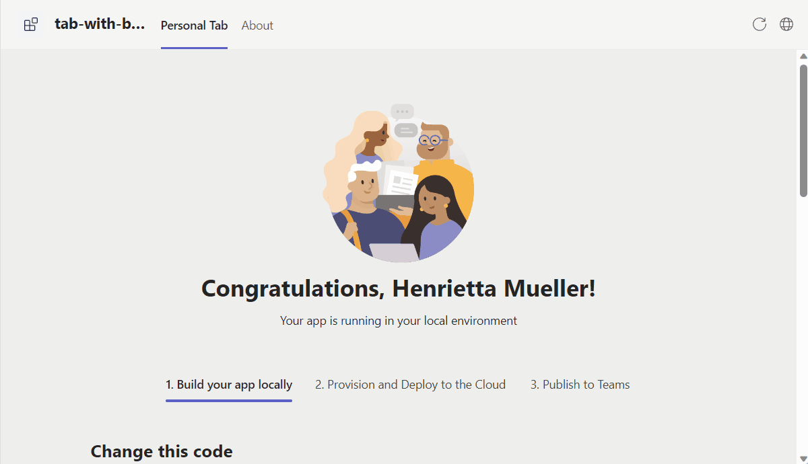

# Getting Started with Hello World Tab with Backend Sample (Azure)

Microsoft Teams supports the ability to run web-based UI inside "custom tabs" that users can install either for just themselves (personal tabs) or within a team or group chat context.

Hello World Tab with Backend shows you how to build a tab app with an Azure Function as backend, how to get user login information with SSO and how to call Azure Function from frontend tab.

> Note: This sample will only provision [single tenant](https://learn.microsoft.com/azure/active-directory/develop/single-and-multi-tenant-apps#who-can-sign-in-to-your-app) Azure Active Directory app. For multi-tenant support, please refer to this [wiki](https://aka.ms/teamsfx-multi-tenant).

## This sample illustrates

- How to use Teams Toolkit to create a Teams tab app.
- How to use TeamsFx SDK to call Azure Functions.
- How to use TeamsFx SDK in Azure Function to call Graph to get user info.

## Prerequisites

- [Node.js](https://nodejs.org/), supported versions: 16, 18
- A Microsoft 365 account. If you do not have Microsoft 365 account, apply one from [Microsoft 365 developer program](https://developer.microsoft.com/en-us/microsoft-365/dev-program)
- [Teams Toolkit Visual Studio Code Extension](https://aka.ms/teams-toolkit) version 5.0.0 and higher or [TeamsFx CLI](https://aka.ms/teamsfx-cli)

# Note
- This sample has adopted [On-Behalf-Of Flow](https://learn.microsoft.com/en-us/azure/active-directory/develop/v2-oauth2-on-behalf-of-flow) to implement SSO.

- This sample uses Azure Function as middle-tier service, and make authenticated requests to call Graph from Azure Function.

- Due to system webview limitations, users in the tenant with conditional access policies applied cannot consent permissions when conduct an OAuth flow within the Teams mobile clients, it would show error: "xxx requires you to secure this device...".

## Minimal path to awesome

### Run the app locally

- From VS Code:
    1. hit `F5` to start debugging. Alternatively open the `Run and Debug Activity` Panel and select `Debug in Teams (Edge)` or `Debug in Teams (Chrome)`.

- From TeamsFx CLI:
    1. Run command: `teamsapp provision --env local` .
    1. Run command: `teamsapp deploy --env local` .
    1. Run command: `teamsapp preview --env local` .

### Deploy the app to Azure

- From VS Code:
    1. Sign into Azure by clicking the `Sign in to Azure` under the `ACCOUNTS` section from sidebar.
    1. Click `Provision` from `LIFECYCLE` section or open the command palette and select: `Teams: Provision`.
    1. Click `Deploy` or open the command palette and select: `Teams: Deploy`.

- From TeamsFx CLI:
    1. Run command: `teamsapp auth login azure`.
    1. Run command: `teamsapp provision --env dev`.
    1. Run command: `teamsapp deploy --env dev`.

### Preview the app in Teams

- From VS Code:
    1. Open the `Run and Debug Activity` Panel. Select `Launch Remote (Edge)` or `Launch Remote (Chrome)` from the launch configuration drop-down.

- From TeamsFx CLI:
    1. Run command: `teamsapp preview --env dev`.

## Version History

|Date| Author| Comments|
|---|---|---|
|May 18, 2022| hund030 | update to support Teams Toolkit v4.0.0|
|Dec 8, 2022| hund030 | update to support Teams Toolkit v5.0.0|

## Feedback
We really appreciate your feedback! If you encounter any issue or error, please report issues to us following the [Supporting Guide](https://github.com/OfficeDev/TeamsFx-Samples/blob/dev/SUPPORT.md). Meanwhile you can make [recording](https://aka.ms/teamsfx-record) of your journey with our product, they really make the product better. Thank you!