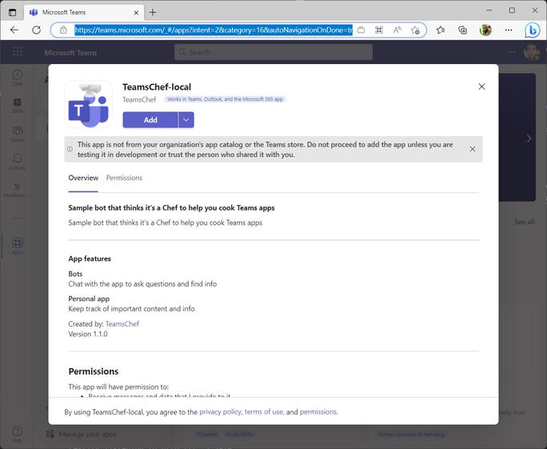
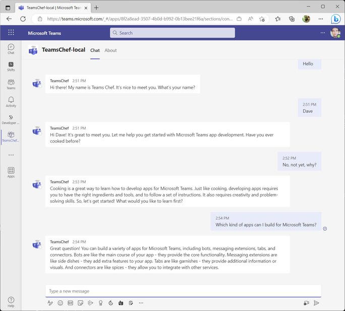

# Microsoft Teams Conversational Bot with Teams AI Library: Teams Chef

This is a conversational bot for Microsoft Teams that impersonates a chef to help you cook Teams apps. The bot uses the text-davinci-003 model to chat with Teams users and respond in a polite and respectful manner, staying within the scope of the conversation.

This sample illustrates basic conversational bot behavior in Microsoft Teams. The bot is built to allow GPT to facilitate the conversation on its behalf, using only a natural language prompt file to guide it.

It showcases capabilities of [Teams AI Library](https://aka.ms/Teams-AI-Library):

<details open>
    <summary><h3>Conversational bot scaffolding</h3></summary>
    Throughout the 'index.ts' file you'll see the scaffolding created to run a simple conversational bot, like storage, authentication, and conversation state.
</details>
<details open>
    <summary><h3>Natural language modelling</h3></summary>
    Notice that outside of one '\history' command, the 'index.ts' file relies on GPT for all its natural language modelling - no code is specifically written to handle language processing. Rather, a 'predictionEngine' is defined to handle this for you:

```javascript
// Create prediction engine
const predictionEngine = new OpenAIPredictionEngine({
    configuration: {
        apiKey: process.env.OPENAI_API_KEY
    },
    prompt: path.join(__dirname, '../src/prompt.txt'),
    promptConfig: {
        model: 'text-davinci-003',
        temperature: 0.4,
        max_tokens: 2048,
        top_p: 1,
        frequency_penalty: 0,
        presence_penalty: 0.6,
        stop: [' Human:', ' AI:']
    },
    logRequests: true
});
```

</details open>
<details open>
    <summary><h3>Prompt engineering</h3></summary>
    Inside the 'predictionEngine', a prompt file is defined:

```javascript
prompt: path.join(__dirname, '../src/prompt.txt'),
```

Open the 'prompt.txt' file to find descriptive prompt engineering that, in plain language and with minor training, instructs GPT how the bot should conduct itself and facilitate conversation:

#### prompt.txt

```
The following is a conversation with an AI assistant, its name is Teams Chef. 
Teams Chef is an expert in Microsoft Teams apps development and the Human is junior developer learning Microsoft Teams development for the first time. 
Teams Chef should always reply by explaining new concepts in simple terms using cooking as parallel concepts. 
Teams Chef should always greet the human, ask them their name, and then guide the junior developer in his journey to build new apps for Microsoft Teams.

{{$history}}
Human: {{$input}}
AI: 
```

</details>
<details open>
    <summary><h3>Conversational session history</h3></summary>
    Because this sample leaves the conversation to GPT, the bot simply facilitates user conversation as-is. But because it includes the 'prompt.txt' file to guide it, GPT will store and leverage session history appropriately. From the 'prompt.txt' file:

```
Conversation history:
{{conversation.history}}
```

For example, let's say the user's name is "Dave". The bot might carry on the following conversation:

```
AI: Hi there! My name is Teams Chef. It's nice to meet you. What's your name?
DAVE: My name is Dave.
AI:Hi Dave! It's great to meet you. Let me help you get started with Microsoft Teams app development. Have you ever cooked before?
DAVE: No, not yet, why?
AI:Cooking is a great way to learn how to develop apps for Microsoft Teams. Just like cooking, developing apps requires you to have the right ingredients and tools, and to follow a set of instructions. It also requires creativity and problem-solving skills. So, let's get started! What would you like to learn first?
DAVE: Which kind of apps can I build for Microsoft Teams?
AI: Great question! You can build a variety of apps for Microsoft Teams, including bots, messaging extensions, tabs, and connectors. Bots are like the main course of your app - they provide the core functionality. Messaging extensions are like side dishes - they add extra features to your app. Tabs are like garnishes - they provide additional information or visuals. And connectors are like spices - they allow you to integrate with other services.
```

Notice that the bot remembered Dave's first message when responding to the second.

</details>
<details open>
    <summary><h3>Localization across languages</h3></summary>
    Because this sample leverages GPT for all its natural language modelling, the user can talk to an AI bot in any language of their choosing. The bot will understand and respond appropriately with no additional code required.
</details>

This bot has been created using [Bot Framework](https://dev.botframework.com).

## Prerequisites

-   Global Administrator access to a [Microsoft 365 tenant](https://developer.microsoft.com/microsoft-365/dev-program?ocid=MSlearn&WT.mc_id=m365-16105-cxa) with [uploading Teams custom apps enabled](https://learn.microsoft.com/en-us/microsoftteams/platform/concepts/build-and-test/prepare-your-o365-tenant#enable-custom-teams-apps-and-turn-on-custom-app-uploading?WT.mc_id=m365-84637-cxa).
-   VS Code [Teams Toolkit](https://learn.microsoft.com/en-us/microsoftteams/platform/toolkit/install-teams-toolkit?tabs=vscode&pivots=visual-studio-code) extension installed
-   [NodeJS](https://nodejs.org/en/)
-   [OpenAI](https://openai.com/api/) key for leveraging GPT

## To try this sample

> Note these instructions are for running the sample on your local machine, the tunnelling solution is required because
> the Teams service needs to call into the bot.

1. Clone the repository

1. Update the `.env.local.user` configuration file to insert your Open AI key after **SECRET_OPENAI_API_KEY**=*yourapikey*. 

1. Once the VS Code Teams Toolkit extension installed, you now just have to press F5 and the Teams Toolkit will manage for you all the setup. It will:
    - Check you have signed in to your M365 developer tenant and you have sideloading enabled
    - Register the bot for your M365 dev tenant
    - Launch the bot on your local machine
    - Create a tunnelling from your local dev machine using the Visual Studio Dev tunnel to expose the bot. You can switch back to other technology if wanted (like ngrok) by following our [documentation](https://github.com/OfficeDev/TeamsFx/wiki/%7BDebug%7D-Teams-Toolkit-VS-Code-Tasks)
    - Launch the Teams web app asking you to add the app to your tenant

If everything worked well, you should have the following flow at the end after pressing F5:





## Interacting with the bot

Interacting with the bot is simple - talk to it! You can invoke it by using @ mention and talk to it in plain language.

The bot uses the text-davinci-003 model to chat with Teams users and respond in a polite and respectful manner, staying within the scope of the conversation. This is possible due to the `skprompts.txt` file's contents.

## Deploy the bot to Azure

To learn more about deploying a bot to Azure, see [Deploy your bot to Azure](https://aka.ms/azuredeployment) for a complete list of deployment instructions or use the Teams Toolkit to help you: [Deploy a Microsoft Teams app to Azure by using Teams Toolkit for Visual Studio Code](https://learn.microsoft.com/en-us/training/modules/teams-toolkit-vsc-deploy-apps/)

## Further reading

-   [How Microsoft Teams bots work](https://docs.microsoft.com/en-us/azure/bot-service/bot-builder-basics-teams?view=azure-bot-service-4.0&tabs=javascript)
-   [Build a bot by using Teams Toolkit for Visual Studio Code](https://learn.microsoft.com/en-us/training/modules/teams-toolkit-vsc-create-bot/)
- [Build apps with Teams AI Library](https://aka.ms/Teams-AI-Library)
